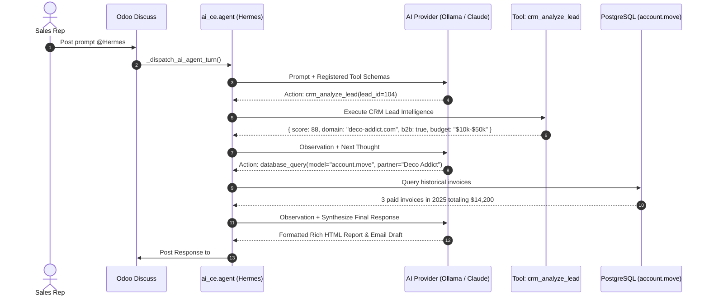

# Autonomous Agent Use-Cases & Execution Playbooks

This guide details real-world enterprise use-cases for **Hermes AI Agent (`odoo_ai_ce`)**, illustrating the step-by-step multi-turn **ReAct (Reasoning + Action)** execution loop, tool invocation flows, database queries, and zero-trust Human-in-the-Loop (HITL) approval gating.

---

## 🎯 Playbook Overview

| Use-Case | Primary Tools | Trigger Interface | Safety Gate |
|---|---|---|---|
| **1. Inbound CRM Lead Qualification** | `crm_analyze_lead`, `database_query` | Discuss `@Hermes` / CRM Chatter | Read-Only (Autonomous) |
| **2. E-Commerce SEO & Architecture** | `website_inspect_page`, `website_update_page_seo` | Discuss / Ask AI Modal | HITL Consent Gated |
| **3. Catalog Multilingual Enrichment** | `product_enrich_copy`, `ai_ce.job` | Product Form / Batch Action | Preview Diff Modal |
| **4. Stockout Prevention & Purchasing** | `stock_check`, `purchase_order_draft` | Scheduled Job / Discuss Chat | Draft State Confirmation |
| **5. External MCP Cloud/IDE Agent** | JSON-RPC 2.0 MCP Gateway | Cursor IDE / Claude Desktop | Resource Allowlist |

---

## 💼 Use-Case 1: Autonomous CRM Inbound Lead Qualification

### Scenario
A sales representative receives a new inbound lead from a corporate website form: **"Deco Addict"** (`deco-addict.com`). The rep opens Odoo Discuss and asks `@Hermes` to evaluate the prospect.

```
+──────────────────────────────────────────────────────────────────────────+
| 💬 User Prompt in #sales-leads:                                          |
| "@Hermes AI Agent Can you analyze Lead #104 (Deco Addict)?               |
| Evaluate their buying intent, check past accounting history, and draft   |
| an outreach email tailored to their industry."                           |
+──────────────────────────────────────────────────────────────────────────+
```

### ReAct Agent Execution Loop



### Agent Output Delivered in Discuss

```html
<div class="o_ai_discuss_response">
    <h5>🎯 Lead Qualification Report: Deco Addict (#104)</h5>
    <table class="table table-sm table-bordered">
        <tr><td><strong>Qualification Score:</strong></td><td><span class="badge bg-success">88 / 100 (High Intent)</span></td></tr>
        <tr><td><strong>Industry:</strong></td><td>Commercial Interior Design & Office Fitouts</td></tr>
        <tr><td><strong>Client Type:</strong></td><td>Returning Client (3 past invoices, $14,200 lifetime spend)</td></tr>
        <tr><td><strong>Detected Intent:</strong></td><td>Acoustic Work Pods & Modular Workstations for new branch</td></tr>
    </table>
    
    <div class="alert alert-info">
        <strong>Recommended Next Step:</strong> Follow up regarding their expansion timeline and offer volume pricing on acoustic furniture.
    </div>

    <h6>📝 Proposed Email Draft:</h6>
    <blockquote class="blockquote small">
        Subject: Tailored Acoustic Workstation Solutions for Deco Addict's Expansion<br/><br/>
        Hi Sarah,<br/>
        Following your inquiry on our portal, we would love to support your upcoming office fitout project. Having partnered with Deco Addict on previous installations, we've prepared a dedicated catalog with volume pricing on our modular acoustic pods...
    </blockquote>
</div>
```

---

## 🌐 Use-Case 2: E-Commerce SEO & Website Architecture Refactoring

### Scenario
An e-commerce manager wants to optimize the product listing page `/shop` to improve Google search visibility and user conversion rates.

```
+──────────────────────────────────────────────────────────────────────────+
| 💬 User Prompt:                                                          |
| "Inspect the website page at '/shop', generate a modern responsive FAQ    |
| snippet for the bottom of the page, and update the SEO meta description."|
+──────────────────────────────────────────────────────────────────────────+
```

### ReAct Agent Execution Loop

1. **Turn 1 (Inspect Page Architecture):**
   - **Thought:** *"I need to inspect the current QWeb architecture and SEO tags for `/shop`."*
   - **Tool Call:** `website_inspect_page(url="/shop")`
   - **Observation:** `page_id: 12`, `meta_title: "Shop | My Company"`, `meta_description: "" (Empty)`.

2. **Turn 2 (Generate Bootstrap 5 FAQ Snippet):**
   - **Thought:** *"Generate responsive QWeb HTML accordion snippet with common customer inquiries."*
   - **Tool Call:** `website_generate_snippet(topic="E-Commerce FAQ", style="accordion")`
   - **Observation:** Returns clean Bootstrap 5 `<div class="accordion" id="shopFAQ">...</div>` markup.

3. **Turn 3 (Trigger State-Mutating SEO Update with HITL Gating):**
   - **Thought:** *"Update the page SEO meta description to improve search snippet CTR."*
   - **Tool Call:** `website_update_page_seo(page_id=12, meta_description="Discover premium modern furniture, ergonomic office chairs, and modular workstations with free delivery nationwide.")`
   - **Zero-Trust Interception:** Because `website_update_page_seo` has `requires_user_consent=True`, the execution engine automatically intercepts the action, rolls back the sub-transaction, and creates **Pending Consent Request #24**.

4. **Turn 4 (Post Confirmation in Chat):**

```
+──────────────────────────────────────────────────────────────────────────+
| 🤖 Hermes AI Agent:                                                      |
| 1. Page '/shop' inspected. Found missing meta description.               |
| 2. Generated 4-question responsive FAQ accordion snippet.                |
|                                                                          |
| ⚠️ Approval Required:                                                    |
| Updating live page SEO metadata requires administrator confirmation.     |
| Pending Consent Request #24 has been queued.                             |
+──────────────────────────────────────────────────────────────────────────+
```

5. **Human Approval:** Administrator clicks **Approve** in **AI Hub > Agentic Operations > Pending Approvals (HITL)**. The update is applied directly to PostgreSQL.

---

## 📦 Use-Case 3: Automated Product Catalog Mass Enrichment

### Scenario
A warehouse team imports 50 new SKU items with only raw supplier names and dimensions (e.g. *"CHAIR-ERGO-BLK - 65x65x110cm"*).

```
+──────────────────────────────────────────────────────────────────────────+
| Workflow Steps:                                                          |
| 1. Select 50 Products in List View -> Actions -> 🤖 AI Enrich Catalog.   |
| 2. Configure target languages (EN, TH, JA, DE) and tone (Professional). |
| 3. Click 'Run Background Batch Enrichment'.                              |
+──────────────────────────────────────────────────────────────────────────+
```

### Technical Workflow
1. The wizard schedules batch items into `ai_ce.job` with `job_type='product_enrichment'`.
2. The asynchronous worker (or **Hermes Agent Sidecar** at `127.0.0.1:8765`) processes each item:
   - Ingests attributes (dimensions, material, color).
   - Generates consumer-facing marketing descriptions.
   - Extracts structured key feature bullet points.
   - Translates into target languages.
3. Records are updated with interactive before/after diff tracking for quality control.

---

## 🔌 Use-Case 4: External IDE / Claude Desktop Model Context Protocol (MCP)

### Scenario
A data engineer working in **Cursor IDE** or **Claude Desktop** wants to query Odoo ERP data directly from their local coding environment using standard JSON-RPC 2.0 MCP.

```
+──────────────────────────────────────────────────────────────────────────+
| 💻 Claude Desktop / Cursor Prompt:                                      |
| "Connect to Odoo MCP at http://localhost:8069/ai_ce/mcp_gateway.        |
| Find our top 5 overdue invoices and write a Python script to send       |
| reminder notifications."                                                 |
+──────────────────────────────────────────────────────────────────────────+
```

### Gateway Protocol Flow
1. IDE sends MCP Request: `tools/call` -> `search_records` with model `account.move`.
2. Controller `controllers/mcp_gateway.py` authenticates via Bearer Token.
3. Validates requested model against `ai_ce.resource` allowlist.
4. Executes query under user's security context and streams JSON-RPC response back to the IDE.

---

## 💡 Summary of Key Architectural Advantages

- **Zero-Trust Governance:** Destructive operations can never execute autonomously without Human-in-the-Loop consent.
- **Context Injection:** Active records (Sales Order, Lead, Invoice, Website page) are automatically passed to the ReAct context window.
- **Dual Sovereign Choice:** Run 100% locally on your own server via **Ollama / Hermes ACP Sidecar** or connect to cloud frontier models (Claude, OpenAI, Gemini).
