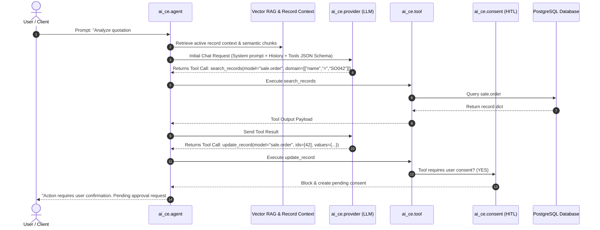

# Architecture & Zero-Trust Security

This document details the architectural blueprint, data flow, security model, and execution mechanics of the **Odoo AI Community Edition (`odoo_ai_ce`)** framework.

---

## 1. High-Level Architectural Blueprint

The framework connects frontend user interfaces, backend autonomous reasoning loops, external client integrations, and local LLM execution environments.

```
+---------------------------------------------------------------------------------------------------+
|                                      OWL 3 FRONTEND LAYER (Odoo 19)                               |
|  +------------------------+  +--------------------------+  +-----------------------------------+  |
|  | Ask AI Modal (Ctrl+K)  |  | HTML Editor /ai Powerbox |  | OWL 3 AI Control Center Dashboard |  |
|  +-----------+------------+  +------------+-------------+  +-----------------+-----------------+  |
+--------------|----------------------------|----------------------------------|--------------------+
               |                            |                                  |
               +----------------------------+----------------------------------+
                                            |
+-------------------------------------------v-------------------------------------------------------+
|                                    ODOO 19 CE BACKEND CORE                                        |
|  +-------------------------+  +--------------------------+  +----------------------------------+  |
|  | Multi-Turn Agent Loop   |  | Tools Registry & Sandbox |  | Asynchronous Batch Job Queue     |  |
|  | (ai_ce.agent)           |  | (@ai_ce_tool / sandbox)  |  | (ai_ce.job)                      |  |
|  +------------+------------+  +------------+-------------+  +----------------+-----------------+  |
|               |                            |                                 |                    |
|  +------------v------------+  +------------v-------------+  +----------------v-----------------+  |
|  | Semantic pgvector RAG   |  | Human-in-the-Loop Consent|  | Granular Security Audit Logs     |  |
|  | (ai_ce.vector.chunk)    |  | (ai_ce.consent)          |  | (ai_ce.log)                      |  |
|  +-------------------------+  +--------------------------+  +----------------------------------+  |
+-------------------------------------------+-------------------------------------------------------+
                                            |
         +----------------------------------+----------------------------------+
         |                                                                     |
+--------v----------------------------------+               +------------------v--------------------+
|  STREAMABLE-HTTP MCP GATEWAY               |               |  LOCAL HERMES AGENT SIDECAR           |
|  - Endpoint: /ai_ce/mcp_gateway           |               |  - Host: 127.0.0.1:8765               |
|  - Protocol: JSON-RPC 2.0                 |               |  - Loopback IPC & Parallel Workers    |
|  - Scoped Resource Allowlist              |               |  - Bidirectional Webhook Callbacks    |
+-------------------------------------------+               +---------------------------------------+
         |                                                                     |
         +----------------------------------+----------------------------------+
                                            |
+-------------------------------------------v-------------------------------------------------------+
|                                    MULTI-PROVIDER LLM HUB                                         |
|  +-------------------------+  +--------------------------+  +----------------------------------+  |
|  | Local Ollama / vLLM     |  | OpenAI (GPT-4o/o3-mini)  |  | Anthropic Claude 3.5 / 3.7       |  |
|  | (Sovereign Offline)     |  | Azure OpenAI Enterprise  |  | Google Gemini 2.0 Flash / Pro    |  |
|  +-------------------------+  +--------------------------+  +----------------------------------+  |
+---------------------------------------------------------------------------------------------------+
```

---

## 2. Multi-Turn Autonomous Agent Reasoning Loop (`ai_ce.agent`)

The agent engine implements a robust **ReAct (Reasoning + Acting)** execution loop:



---

## 3. Zero-Trust Security & Governance Architecture

The `odoo_ai_ce` framework enforces multi-layered zero-trust security constraints:

### 3.1 Human-in-the-Loop (HITL) Consent Queue (`ai_ce.consent`)
- All state-mutating actions (`create_record`, `update_record`, `delete_record`, and any tool marked with `requires_user_consent=True`) are intercepted.
- Intercepted calls generate a pending record in `ai_ce.consent` storing the exact JSON argument payload.
- Authorized users in the `AI Consent Approver` group can review and click **"Approve & Execute"** or **"Reject"**.

### 3.2 Strictly Enforced Resource Allowlist (`ai_ce.resource`)
- Prevents external MCP clients and autonomous agents from reading or modifying arbitrary database tables.
- Only models explicitly registered and enabled in `ai_ce.resource` (e.g. `res.partner`, `product.template`, `sale.order`) are accessible.
- Accessing unlisted models raises an `AccessError`.

### 3.3 Granular Per-User Security Audit Logging (`ai_ce.log`)
- Every agent invocation, MCP tool call, and background job logs an immutable audit entry in `ai_ce.log`.
- Tracks:
  - Caller User ID (`user_id`).
  - Client Origin (`web`, `mcp`, `hermes`, `bot`).
  - Tool executed and arguments preview.
  - Execution latency in milliseconds.
  - Execution status (`success`, `error`, `consent_blocked`).

---

## 4. Multi-Provider Abstraction & Fallback Engine (`ai_ce.provider`)

Providers are configured in `ai_ce.provider` and support automatic cascading failover:

1. **Normalized API Layer:** Standardizes chat completion and embedding requests across different API formats (Ollama native REST, OpenAI JSON format, Anthropic Claude headers, Google Gemini v1beta).
2. **Encrypted Secret Storage:** API keys are protected and masked in form views.
3. **Priority & Fallback Chains:** Each provider has a numeric priority. If the primary provider encounters HTTP errors, rate limits, or network timeouts, the engine automatically retries with configured `fallback_provider_ids`.

---

## 5. Hybrid Knowledge Grounding & RAG (`ai_ce.vector.chunk`)

Grounding is achieved through two complementary mechanisms:
1. **Active Record Context Injection:** When Ask AI or an Agent is invoked from a form or view, the active record's field values, relations, and recent chatter messages are injected into the context window.
2. **pgvector / Semantic Embedding Store:** Attachments, product documentation, and notes are chunked (800 chars with 100 char overlap) and stored in `ai_ce.vector.chunk`. Queries use cosine similarity to retrieve the top $K$ relevant chunks.
