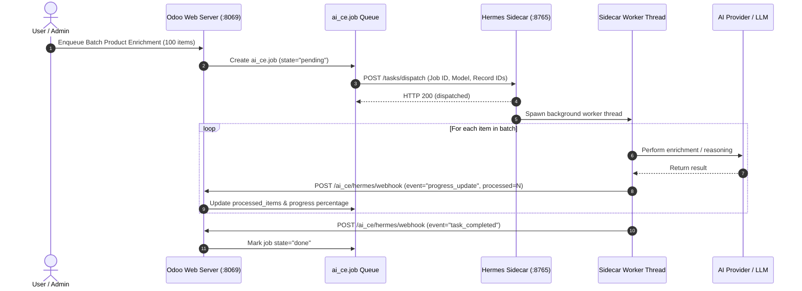

# Hermes Agent Sidecar & Asynchronous Job Queue

The **Hermes Agent Sidecar** is a lightweight, high-performance background daemon that runs alongside Odoo on loopback `127.0.0.1:8765`. It acts as an autonomous worker supervisor, executing multi-step batch tasks (e.g. catalog enrichment across 1,000 products, web research, or vector embedding generation) without blocking Odoo's web request threads.

---

## 🏗️ Architecture & Interaction Flow



---

## 🚀 Running the Sidecar

### Direct Execution
From the root of your Odoo installation:
```bash
python odoo_ai_ce/sidecar/hermes_sidecar_runner.py
```

### Running as a systemd Service (Linux Production)
Create `/etc/systemd/system/hermes-sidecar.service`:
```ini
[Unit]
Description=Hermes Agent Sidecar for Odoo
After=network.target

[Service]
Type=simple
User=odoo
WorkingDirectory=/opt/odoo/custom_addons/odoo_ai_ce
ExecStart=/usr/bin/python3 /opt/odoo/custom_addons/odoo_ai_ce/sidecar/hermes_sidecar_runner.py
Restart=always
RestartSec=5

[Install]
WantedBy=multi-user.target
```

Enable and start the service:
```bash
sudo systemctl daemon-reload
sudo systemctl enable --now hermes-sidecar
```

---

## 📡 REST API & Health Endpoints

### 1. Health Status (`GET /health`)
```bash
curl http://127.0.0.1:8765/health
```
Response:
```json
{
  "status": "healthy",
  "version": "1.1.0",
  "uptime": 1771804800.0,
  "agent": "Hermes Autonomous Supervisor & Worker Pool",
  "active_workers": 2
}
```

### 2. Dispatch Task (`POST /tasks/dispatch`)
Request Payload:
```json
{
  "task": "Batch Product Catalog Enrichment",
  "callback_url": "http://127.0.0.1:8069/ai_ce/hermes/webhook",
  "payload": {
    "job_id": 42,
    "job_type": "product_enrich",
    "res_model": "product.template",
    "res_ids": [101, 102, 103, 104, 105]
  }
}
```

---

## 📊 Managing Background Jobs in Odoo

1. Navigate to **AI Hub > Agentic Operations > Background Jobs**.
2. View all queued, in-progress, completed, and failed tasks.
3. Inspect live progress percentage, processed item count, and real-time execution logs.
4. Click **"Execute / Retry"** or **"Cancel"** on any job record.
